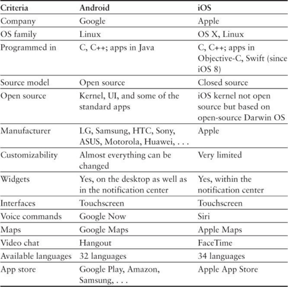

**Глава 2. Знакомство с мобильными устройствами и приложениями**

Прежде чем углубиться в тему тестирования, я хотел бы познакомить вас с историей мобильных устройств и сотовых сетей. 
Это может показаться немного скучным, но, в конце этой главы вы сами убедитесь, что действительно важно знать историю 
мобильного мира и иметь глубокие знания о прошлом мобильных технологий. Далее я опишу различные типы мобильных приложений 
и бизнес-модели приложений, а также предоставлю вам краткий обзор текущего состояния магазинов мобильных приложений.

Давайте начнем со слова мобильный. Оно происходит от латинского слова mobilis, которое само по себе происходит от латинского 
глагола movere, “двигаться” — иметь возможность свободно и легко передвигаться при ходьбе, вождении или полете.
Это определение звучит действительно просто и понятно, и я уверен, что представляли его примерно так же. Если вы посмотрите 
на слово "мобильный" с технологической точки зрения, это не так просто из-за огромных изменений в том, как люди начали 
использовать мобильные технологии за последние несколько десятилетий.

Итак, давайте вернемся на несколько десятилетий назад.

**Обзор мобильных сетей**
Прежде чем мы сможем полноценно взаимодействовать с мобильными устройствами, нам должна быть доступна инфраструктура связи. 
В настоящее время мобильная инфраструктура это четвертое поколение, известное как 4G или LTE (Long-Term Evolution). [1] 
До этого мы использовали 0G, 1G, 2G и 3G поколения, и каждое поколение было важной вехой на момент его появления.

> [1] www.etsi.org/technologies-clusters/technologies/mobile/long-term-evolution

Нулевое поколение (0G) — ранние предшественники — включало только аналоговую радиосвязь и использовалось в основном в 1960-х годах. 
Она также известна как Система мобильной радиотелефонной связи. Связь в то время была полудуплексной, что означало, что 
одновременно только один человек мог говорить, в то время как другой слушал. Нулевое поколение состояло из различных мобильных 
технологий, таких как Mobile Telephone Service (MTS), Mobile Telephony System D (MTD), Advanced Mobile Telephone System (AMTS) 
и Offentlig Landmobil Telefoni (OLT). Сотовые телефоны были тяжелыми и устанавливались в основном в грузовиках, поездах
и других транспортных средствах. Телефон состоял из двух частей: приемопередатчика (передатчика и приемника) и головки. 
Приемопередатчик отвечал за установление соединения с местными передающими станциями, а головка подключается к приемопередатчику 
и состоит из клавиш набора номера, дисплея и телефонной трубки. У этого поколения было много проблем с подключением и 
ограничениям по количеству абонентов.

Сотовая сеть первого поколения (1G) была усовершенствована по сравнению с нулевым поколением и была запущена в 1980-х годах. 
1G по-прежнему использовала аналоговые радиосигналы для передачи информации с использованием технологии Advanced Mobile 
Phone Service (AMPS) или Nordic Mobile Telephone (NMT). Первые сети были запущены в Японии, за ними последовали Дания, 
Финляндия, Норвегия, Швеция и Соединенные Штаты. Пару лет спустя другие страны создали свою сетевую инфраструктуру 1G. 
Самым большим преимуществом перед нулевым поколением было то, что 1G была способен вместить в десять раз больше абонентов, 
разделив локальную область на меньшие ячейки. У этого поколения были свои недостатки, когда дело касалось безопасности, 
поскольку пользователи могли прослушивать чужие разговоры и взламывать систему, чтобы совершать бесплатные звонки. 

Самое большое улучшение в сетях мобильной связи было достигнуто с приходом второго поколения сотовых сетей (2G). 2G был впервые запущен в 1991
году в Финляндии с использованием стандарта GSM (Глобальная система мобильной связи).[2]
Пару лет спустя CDMA (множественный доступ с кодовым разделением) был запущен в Соединенных Штатах.[3] Эти новые 
стандарты легли в основу современной инфраструктуры мобильной связи и предложили три основных преимущества по сравнению со своими предшественниками:

> [2] www.etsi.org/technologies-clusters/technologies/mobile/gsm>
> [3] www.etsi.org/technologies-clusters/technologies/mobile/w-cdma

- Впервые в истории связь была цифровой и зашифрованной.
- 2G был намного эффективнее и обеспечивал лучшее глобальное покрытие сотовой связи.
- Были внедрены службы передачи данных, наиболее широко известной из которых является СМС.

Сеть 2G была построена в основном для голосовой и текстовой связи, имеет только медленную передачу данных. После создания 
сетей 2G использование услуг мобильной связи увеличилось, а передача данных стала слишком медленной. Для достижения более 
высоких скоростей передачи данных сеть 2G была расширена с помощью GPRS (General Packet Radio Service)[4] и EDGE 
(Enhanced Data rates for Global Evolution)[5] стандартов. GPRS также называется 2.5G, а EDGE - 2.75G. Обе технологии 
имели более высокие скорости передачи данных (GPRS = 56 Кбит/с до 115 Кбит/с, EDGE = до 236 Кбит/с), сеть 2G 
являются предшественниками сети 3G.

> [4] www.etsi.org/index.php/technologies-clusters/technologies/mobile/gprs
> [5] www.etsi.org/index.php/technologies-clusters/technologies/mobile/edge

Третье поколение мобильных сетей (3G) существует с 2001 года и является продолжением существующих сетей 2G. Третье поколение 
использует UMTS (Universal Mobile Telecommunications System)[6] и стандарты CDMA2000. 3G обеспечивает высокоскоростную 
передачу данных со скоростью до 21 Мбит/с в зависимости от текущего местоположения пользователя. Высокая скорость передачи 
данных позволяет пользователям смартфонов, планшетов или компьютеров совершать видео звонки, смотреть мобильное телевидение 
и пользоваться Интернетом в дороге. Сети 3G с их высокими скоростями передачи данных оказали большое влияние на успех 
мобильных устройств и приложений.

> [6] www.etsi.org/technologies-clusters/technologies/mobile/umts

Четвертое поколение сетей мобильной связи (4G/LTE) подходят для огромных объемов данных, которые в настоящее время 
передаются по сети, за счет еще большего увеличения скорости передачи данных. Сеть 4G в основном разделена на два 
стандарта: WiMAX (Worldwide Interoperability for Microwave Access)[7] и LTE. WiMAX обеспечивает скорость передачи данных 
при отправке до 128 Мбит/с, и скорость загрузки до 56 Мбит/с. LTE обеспечивает скорость отправки до 100 Мбит/с и скорость 
загрузки до 50 Мбит/с. Если оба стандарта будут полностью реализованы, скорость загрузки может увеличиться до 1 Гбит/с.

> [7] www.wimaxforum.org/index.htm

В зависимости от вашего поставщика услуг и страны, ваш смартфон подключен либо к сети WiMAX, либо к сети LTE. Если ваш 
телефон поддерживает сети 4G, вы увидите маленький значок LTE или 4G в строке состояния телефона.

В настоящее время разрабатывается пятое поколение мобильных сетей. Было сформировано несколько исследовательских групп 
для описания и разработки следующего поколения мобильной связи и архитектуры. Однако этот стандарт будет доступен не 
ранее 2020 года. [8]

> [8] http://europa.eu/rapid/press-release_IP-13-159_en.htm

Это был поверхностный обзор технологий, лежащих в основе мобильных сетей, но даже этот поверхностный обзор важен, когда 
вы начинаете тестировать свое приложение в разных сетях с использованием разных стандартов. Важно знать, какие сетевые 
стандарты доступны и какие скорости сети предоставляются. Дополнительная информация о том, как тестировать различные сети 
передачи данных, будет предоставлена в последующих главах. Я настоятельно рекомендую вам использовать эти знания при 
ежедневном тестировании приложений.

**Мобильные устройства и 2007 год**

До 2007 года большинство телефонов были так называемыми "тупыми телефонами" (как описано в Главе 1), функциональность которых 
не могла быть расширена с помощью программного обеспечения (приложений). Не все из них могли подключиться к Интернету, 
даже когда мобильные сети были способны обрабатывать передачу данных. В то время на рынке мобильных устройств доминировали 
Nokia, Motorola, BlackBerry (Research in Motion) и некоторые другие производители мобильных устройств. Большинство устройств 
имели небольшой экран и физическую клавиатуру и годились только для совершения звонков или отправки текстовых сообщений. 
Однако эти устройства было неудобно использовать при попытке серфинга в Интернете или поиска контактов в телефоне.

Революция смартфонов началась в январе 2007 года, когда Apple выпустила свой первый iPhone. Стив Джобс представил первое 
поколение iPhone со следующей фразой: “Сегодня Apple собирается заново изобрести телефон”.

И Стив Джобс был прав. Рынок мобильных устройств, сильно изменился с 2007 года. Всего год спустя Google представила первый 
Android - смартфон, разработанный HTC, HTC Dream (также известный как T-Mobile G1). В последующие годы многие другие 
производители создали свои собственные Android-смартфоны с различными версиями программного обеспечения для Android.

Когда Apple анонсировала iPhone, только Google оказалась достаточно гибкой, чтобы адаптироваться и создать еще одну 
мобильную платформу. Тем не менее Microsoft и BlackBerry (Research in Motion) обновили свои мобильные технологии, чтобы 
сократить разрыв между своими решениями и Apple и Google, но до сих пор им так и не удалось наверстать упущенное.

С 2007 года смартфоны постоянно совершенствуются с помощью новых аппаратных и программных функций, и иногда бывает трудно 
уследить за всеми новыми функциями, которые появляются на рынке мобильных устройств.

Вам нужно знать, что находится внутри смартфона, чтобы получить общее представление о его физических компонентах и о том, 
что делает каждый из них. Эти знания помогут вам понять, какие устройства вы хотите протестировать, что, в свою очередь, 
поможет вам тестировать более эффективно.

Если вы посмотрите на мобильное устройство рядом с вами, то увидите маленький, тонкий и плоский или изогнутый кусочек 
стекла, пластика или металла. Все оборудование, необходимое для воплощения этой маленькой штуковины в жизнь, упаковано 
в маленький корпус и не видно пользователю. Но что там внутри?

Типичный смартфон состоит из следующих аппаратных компонентов:
- Материнская плата или логическая плата
- CPU (центральный процессор)
- GPU (графический процессор)
- Память

- Различные антенны и интерфейсы:
- Чипы сотовой сети для подключения к 2G, 3G или 4G
- Wi-Fi
- NFC (связь в ближнем поле)
- GPS (глобальная система позиционирования)
- Bluetooth

- Различные датчики (необязательно все из этого списка):
- Датчик окружающего освещения
- Датчик приближения
- Датчик ускорения
- Гироскоп
- Магнитный датчик
- Датчик давления
- Датчик температуры
- Датчик влажности

- Аккумулятор
- Вибродвигатель
- Слот для дополнительной карты памяти
- Слот для SIM-карты

А вот что вы можете увидеть, когда держите смартфон в руке:
- Корпус для смартфона
- Сенсорный экран
- Аппаратные кнопки (кнопка включения, кнопка увеличения и уменьшения громкости, навигация кнопки)
- Разъем для наушников
- Динамики и микрофоны
- Разъем зарядного устройства / USB
- Передняя и задняя камеры
- Вспышка

Если вы хотите получить более подробную информацию о конкретном телефоне, просто воспользуйтесь Интернетом и найдите 
раздел “разборка” устройства или посетите веб-сайт производителя устройства. Перечисленное мною оборудование в какой-то 
мере также относится к планшетам.

Как мобильный тестировщик, очень важно, чтобы вы знали все возможные модули мобильного устройства. Эти знания необходимы 
для выявления и локализации ошибок, которые могут быть связаны с аппаратным обеспечением устройства или вашим приложением.

**Большая Двойка**

Как упоминалось в предыдущей главе, другие мобильные платформы, такие как Windows Phone и BlackBerry, занимают очень 
небольшую долю рынка по сравнению с Android и iOS.[9] По состоянию на февраль 2015 года доли рынка были следующими: 
Android - 55,26%; iOS - 23,82%; Windows Phone - 2,32%; и BlackBerry - 1,66%. Недостающие 17% включают устройства под 
управлением Symbian, Series 40 и других устаревших мобильных операционных систем.

>[9] Точные данные о доле рынка можно найти здесь: http://gs.statcounter.com

> **Важно,**
> эти цифры, конечно, будут варьироваться в зависимости от географического
> положения, но они являются хорошим показателем общей картины.

Поскольку BlackBerry и Windows Phone занимают очень небольшую долю рынка, в оставшейся части я фокусируюсь на двух 
больших группах устройств: iOS и Android.

В чем различия между двумя операционными системами? Что в них есть общее? Таблица 2.1 сравнивает операционные системы 
на основе определенных критерии.

Таблица 2.1 Сравнение Android и iOS

Как вы можете видеть, обе платформы имеют множество общих технологий, функций и приложений, таких как приложения для 
голосовых команд, карты, видеочаты, электронная почта, календарь и многое другое. Но если вы посмотрите на исходную модель и
языки программирования, вы заметите основные различия. Части операционной системы Android с открытым исходным кодом 
написаны на C и C ++. Приложения для Android написаны на Java. iOS также написана на C и C ++ и имеет закрытый исходный 
код. Приложения для iOS написаны на Objective-C или Swift. iOS использует операционную систему Darwin с открытым исходным 
кодом в качестве основы системы, но готовая версия iOS, как мы знаем, имеет закрытый исходный код.

Еще одно очевидное различие между ними - производители. Apple производит устройства iOS самостоятельно, в то время как 
Google дает другим производителям возможность создавать свои собственные аппаратные устройства на базе операционной 
системы Android. Производители могут расширять исходную операционную систему Android и создавать индивидуальную версию 
Android, адаптированную к оборудованию.

Мобильные тестировщики должны знать все об особенностях разных производителей, поскольку пользовательские интерфейсы на 
Android могут сильно отличаться и, следовательно, влиять на поведение приложения. Фрагментация устройств Android и версий 
программного обеспечения - одна из основных проблем, с которыми приходится сталкиваться мобильным тестировщикам. Тем не 
менее на рынке доступно устройство с чистым Android, поскольку Google сотрудничает с некоторыми производителями оборудования 
для создания своих устройств линейки Nexus.

Наконец, я хочу показать различия между пользовательскими интерфейсами. Обе платформы предоставляют сенсорные интерфейсы, 
которые имеют множество общих жестов, таких как пролистывание, нажатие, щелчок и масштабирование, но каждая из них имеет 
свой собственный пользовательский интерфейс и шаблоны проектирования. Для получения полных инструкций ознакомьтесь с 
руководством по дизайну Android[10] и iOS[11]. С каждой новой версией операционной системы учитывайте эти рекомендации, 
поскольку возможны изменения. Эти шаблоны необходимо соблюдать, чтобы опубликовать приложение. Если ваше приложение не 
соответствует рекомендациям, оно вполне может быть отклонено из App Store. С большей вероятностью это произойдет в 
Apple App Store, чем в магазинах приложений для Android. Чтобы получить общее представление о возможных причинах отклонения 
приложения из app Store, просмотрите страницу “Общие отклонения приложений”, предоставленную Apple.[12]

> [10] https://developer.android.com/design/index.html
> [11] https://developer.apple.com/design/
> [12] https://developer.apple.com/app-store/review/rejections/

Еще одна веская причина следовать рекомендациям дизайна - сделать клиентов счастливыми, потому что они знают, как использовать 
специфические для платформы действия, такие как пролистывание слева направо для переключения видов или потянуть вниз, 
чтобы обновить текущее окно.

После загрузки устройства обе платформы предоставляют пользователю начальный экран, похожий на рабочий стол компьютера. 
В то время как начальный экран iOS содержит только ряды значков приложений, разбросанных по нескольким начальным экранам, 
Android предоставляет пользователю возможность настраивать начальный экран с помощью приложений и виджетов [13]. Виджеты 
могут отображать на рабочем столе дополнительную информацию, например содержимое приложения электронной почты, Twitter 
или информацию о погоде. Виджеты можно изменять в размерах и размещать там, где пользователь захочет их разместить. 
Начиная с iOS 8, пользователи также могут размещать виджеты в центре уведомлений iOS [13].

> [13] https://developer.android.com/guide/topics/appwidgets/index.html
 
На обеих платформах домашних экранов в нижней части есть раздел dock для закрепления наиболее важных приложений, доступных 
на каждом домашнем экране. Кроме того, обе платформы имеют строку состояния, доступную в верхней части экрана и отображающую 
информацию, относящуюся к устройству, такую как состояние батареи, уровень сети, текущее время и любые уведомления от 
установленных приложений. Опять же, на Android в строке состояния может отображаться дополнительная информация, такая как 
полученные электронные письма, сообщения, телефонные звонки или напоминания, связанные с установленными приложениями.

Если вы знакомы только с одной платформой, вам следует купить или арендовать ту, которой вы не знакомы, чтобы узнать о 
ней все. Вам нужно будет знать как можно больше об основных платформах, чтобы добиться успеха в долгосрочной перспективе 
в роле мобильного тестировщика.

**Какие типы приложений существуют?**

Если вы разблокируете телефон, чтобы перейти к главному экрану, вы увидите установленные приложения. Но какие типы приложений 
вы видите? Являются ли они нативными, гибридными или веб-приложениями? Если вы просто посмотрите на значок приложения, вы, 
вероятно, не сможете это понять. Возможно, вы сможете это понять, нажав на значок приложения открыв его.

Давайте попробуем. Возьмите свое мобильное устройство, разблокируйте его и откройте приложение на свой выбор.

Что вы видите? Вы видите окно браузера или приложение отображается в полноэкранном режиме? Если вы видите окно браузера, 
значит, ваше приложение является веб-приложением.

Но видите ли вы разницу между гибридным и нативным приложением? Это зависит от того, насколько хорошо разработано и 
оптимизировано гибридное приложение для вашего телефона.

В следующем разделе я опишу различные типы мобильных приложений и перечислю плюсы и минусы каждого из них.

**Нативные приложения**

Нативные приложения программируются с использованием определенного языка программирования для конкретной мобильной платформы. 
Например, приложения для Android разрабатываются на Java, тогда как приложения для iOS написаны на Objective-C или Swift. 
Нативные приложения имеют полный доступ ко всем библиотекам и API, доступными на платформе, чтобы воспользоваться всеми 
возможностями, которые может предложить современный смартфон. Если пользователь предоставил необходимые разрешения, 
приложение имеет прямой доступ к камере, GPS и всем другим датчикам. Разработчики могут создавать приложения, использующие 
системные ресурсы, такие как GPU и CPU, для создания более мощных приложений. Нативные приложения, как правило, обладают 
высокой производительностью и оптимизированы для мобильных платформ. В большинстве случаев нативные приложения выглядят 
и работают великолепно, а так же способны поддерживать все возможные жесты на сенсорном экране.

Распространение нативных приложений также довольно просто, поскольку вы можете загрузить свое собственное приложение в 
магазины разных поставщиков и начать его продавать. У некоторых магазинов приложений есть процесс одобрения, а это означает, 
что может потребоваться некоторое время, пока ваше приложение стало доступным. Тот же процесс применяется при обновлении 
уже выпущенного приложения, что может стать проблемой, особенно если вы хотите исправить действительно срочную ошибку в 
своем приложении.

**Плюсы:**

- Нативные приложения имеют полный доступ к аппаратным и программным возможностям платформы.
- Нативные приложения обладают хорошей производительностью, поскольку они оптимизированы для конкретной мобильной платформы.
- Нативные приложения имеют приятный внешний вид.
- Нативные приложения обеспечивают хорошее удобство использования при соблюдении правил пользовательского интерфейса платформы.
- Нативные приложения имеют полный доступ ко всем жестам (если они реализованы).
- Распространение собственных приложений очень простое. Пользователи могут легко найти ваше приложение.
- Нативные приложения могут хранить данные в автономном режиме.

**Минусы:**

- Объем работ по разработке увеличивается с каждой новой платформой, потому, что каждой платформе нужна своя собственная кодовая база.
- Процесс одобрения со стороны магазина приложений может быть довольно длительным.
- Обновление выпущенного приложения может занять некоторое время (что раздражает, когда речь идет о срочных исправлениях ошибок).
- Затраты на разработку могут быть выше.
- Вы должны делиться 30% доходов от своих приложений с магазинами приложений.

**Гибридные приложения**

Гибридные приложения, как следует из названия, — это приложения, которые включают в себя различные веб технологий, такие 
как HTML или JavaScript. После создания веб-части, разработчики могут скомпилировать эту кодовую базу в различные нативные 
форматы: Android, iOS, Windows Phone или BlackBerry. Чтобы скомпилировать веб-код в нативный мобильный код, разработчикам 
необходимо использовать гибридную среду разработки, такую как PhoneGap[14]. Такие фреймворки предлагают API-интерфейсы для 
доступа к специфичным для устройства аппаратным функциям в веб-части приложения.

> [14] http://phonegap.com/

Как работает такая структура?

> Важно:
> приведенное здесь описание представляет собой очень упрощенный взгляд на работу гибридных мобильных
> фреймворков.

Фреймворк создает так называемый мост к веб-коду через механизм рендеринга HTML. Небольшая часть приложения работает в 
нативной операционной системе и взаимодействует с веб-кодом в механизме рендеринга через мост. С помощью этого моста веб-код 
может получить доступ к некоторым встроенным аппаратным функциям.

HTML-контент или компоненты гибридных приложений могут размещаться на сервере. Такой подход позволяет очень легко вносить 
небольшие обновления, не отправляя все обновленное приложение в магазин приложений. Хранение информации и элементов на 
сервере имеет один большой недостаток, содержимое и элементы не работают, когда телефон отключен. Эти части доступны, 
только если устройство подключено к сети передачи данных. Тем не менее вы можете поместить весь контент и элементы в 
приложение для полной автономной работы, но тогда небольшие онлайн-обновления больше будут невозможны. Если ваша команда 
разрабатывает гибридное приложение, вам следует помнить об этих моментах.

Плюсы:
- Существует одна база кода для разных мобильных платформ.
- Фреймворки предоставляют доступ к функциям оборудования.
- На сервере можно выполнять небольшие обновления.
- Распространение приложений достаточно простое.
- Пользователи могут легко найти ваше приложение.

Минусы:
- Производительность снижается при запросе контента и компонентам с сервера.
- Соблюдать рекомендаций по разработке на различных мобильных платформах будет нелегко.
- Невозможно разработать функции, зависящие от платформы, поскольку они могут не быть доступным на других платформах.
- Процесс одобрения в магазинах приложений может быть длительным.

Хорошее сравнение различных платформ мобильной разработки можно найти на сайте “Сравнительная таблица мобильных платформ”[15].

> [15] http://mobile-frameworks-comparison-chart.com/

**Веб-приложения**

Мобильное веб-приложение - это веб-сайт, доступ к которому можно получить из веб-браузера устройства. Такие веб-сайты 
оптимизированы для использования в мобильных браузерах и не зависят от мобильной платформы. Мобильные веб-приложения 
разрабатываются с использованием веб-технологий, таких как HTML и JavaScript, в частности с HTML5[16], CSS3, и JavaScript [17].

> [16] http://dev.w3.org/html5/html-author/
> [17] www.w3.org/Style/CSS/

HTML5 предоставляет разработчикам возможность создавать мобильные веб-сайты с анимированными и интерактивными элементами. 
Они могут интегрировать аудио- или видеофайлы и использовать функции получения данных о местоположении, а также некоторые 
функции локального хранилища. Использование HTML5, CSS3 и JavaScript упрощает разработку мобильных веб-приложений. Кроме 
того, мобильные веб-приложения не требуют одобрения от магазинов мобильных приложений и могут быть легко и быстро обновлены.

Однако у мобильных веб-приложений есть некоторые недостатки. Например, они предлагают только очень ограниченный доступ к 
аппаратным функциям устройства, таким как датчики приближения или ускорения. Мобильные веб-приложения не имеют доступа к 
камере, компасу, микрофону или каким-либо уведомлениям. Они, как правило, работают медленнее, чем нативные или гибридные 
приложения, поскольку им необходимо загружать всю информацию, отображаемую на экране.

В зависимости от мобильного браузера мобильные веб-приложения могут работать и вести себя по-разному, поскольку не все 
мобильные браузеры поддерживают полные стандарты HTML5, CSS3 и JavaScript. Это может оказать серьезное влияние на мобильное
веб-приложение, а это означает, что в процессе тестирования необходимо учитывать различные типы мобильных веб-браузеров.

Подводя итог, можно сказать, что веб-приложения обладают следующими преимуществами и недостатками:

Плюсы:
- Для разработки используются популярные технологии.
- Веб-приложения внедряются быстрее и дешевле, чем нативные или гибридные приложения.
- Они не зависят от мобильной платформы.
- Есть легкий доступ к ним через веб-браузер (без обязательной установки).
- Не требуется отправка в магазины приложений.
- Процесс обновления происходит легко и быстро.

Минусы:
- Доступ к аппаратным функциям ограничен.
- Сильно ограничена возможность работы в автономном режиме.
- Большие медиафайлы, такие как изображения или видео, могут требовать много времени для загрузки.
- Веб-браузеры по-разному поддерживают веб стандарты, такие как HTML5, CSS3 и JavaScript.
- Веб-приложения не так удобны в использовании, как нативные.
- Использование сенсорных жестов ограничено.
- Пользователи не смогут найти приложение в магазинах приложений.

**Freemium**

Модель freemium рассчитана на охват как можно большего числа пользователей.

После установки приложения существует несколько способов получения дохода от бесплатного приложения:
- Наиболее широко используемый подход - бесплатная версия приложения которая ограничена, например, с точки зрения функциональности 
или содержания. Если пользователь хочет иметь полную функциональность, он может загрузить расширенную (платную) версию приложения. 
Этот подход является наиболее широко используемой моделью приложения freemium.
- Вторым наиболее часто используемым подходом к получению доходов является продажа рекламы внутри приложения. Существуют 
различные форматы рекламы, которые могут быть интегрированы в приложение для получения дохода. Реклама является частью 
почти каждого бесплатного приложения и часто может раздражать пользователя. Тщательно подумайте, прежде чем добавлять 
рекламу в приложение, так как вы рискуете потерять клиентов. Разработчики могут внедрять рекламные платформы, такие как 
AdMob[18] или iAd[19].

> [18] www.google.com/ads/admob/
> [19] http://advertising.apple.com/

- Третий подход к получению доходов - это “встроенные покупки в приложении”. Это часто используется в игровых приложениях, 
где можно приобрести новые уровни или дополнительные инструменты, чтобы получать больше удовольствия от игры. Многие 
газетные приложения также предлагают покупки в приложении, чтобы получать последнюю версию своих ежедневных новостей. 
Некоторые приложения могут отключать рекламу, если пользователь заплатит за это.
